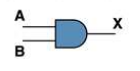
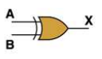
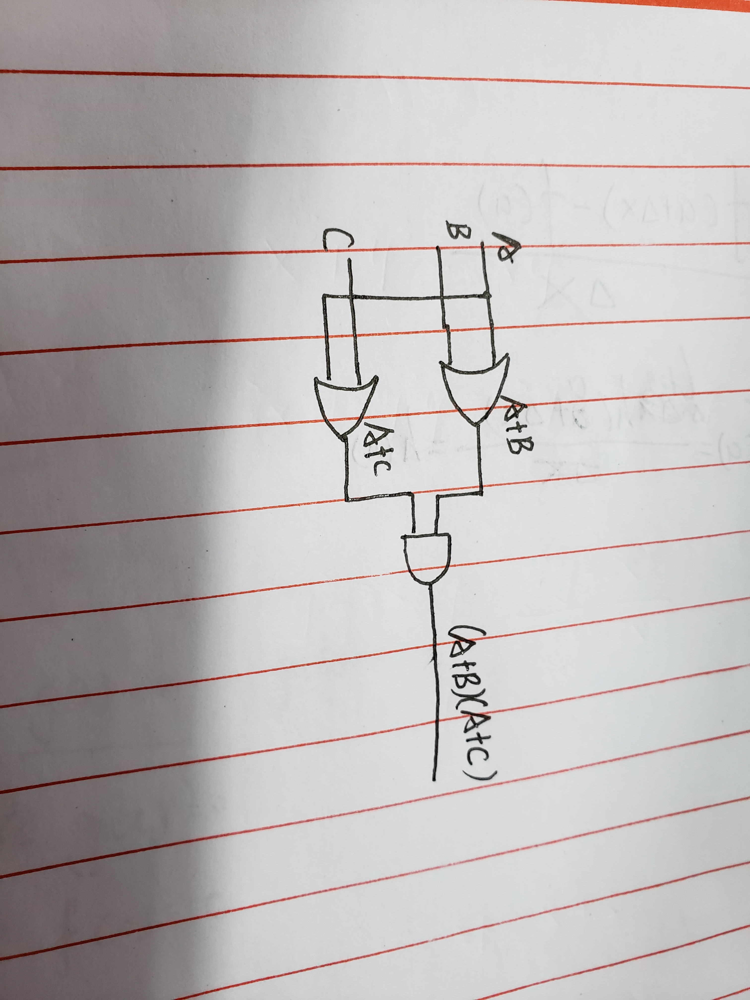

# 名词解释

## 1. AND

### Boolean Expression
X=A·B          
### Logic Diagram Symbol  

### Truth Table
| A    | B         | X |
|:-------------|:------------------|:------|
| 0| 0| 0|
| 1| 0| 0|
| 0| 1| 0|
| 1| 1| 1| 

 与门就是只有两个输入都是一的时候输出是一，其他时候输出都是0的一个开关。

## 2. XOR

### Boolean Expression
X=A⊕B          
### Logic Diagram Symbol  

### Truth Table
| A    | B         | X |
|:-------------|:------------------|:------|
| 0| 0| 0|
| 1| 0| 1|
| 0| 1| 1|
| 1| 1| 0| 

 异或门就是只有两个输入不一样的时候输出是一，一样的时候输出都是0的一个开关。

 ## 3.

 

## 4.

| A    | B         | X |
|:-------------|:------------------|:------|
| 0| 0| 1|
| 1| 0| 0|
| 0| 1| 1|
| 1| 1| 1|

## 5.

| A    | B         | (AB)'|A'+B'|
|:-------------|:--------------|:------|:--|
| 0| 0| 1| 1|
| 1| 0| 0| 0|
| 0| 1| 0| 0|
| 1| 1| 0| 0|

## 6.

![](images/19.jpg

## 7.

1.X8X7X6X5X4X3X2X1
2.X8X7X6X50000
3.X8X7X6X5X4X3X2X1

# 名词解释

## Logic gate

    In electronics, a logic gate is an idealized or physical device implementing a Boolean function; that is, it performs a logical operation on one or more binary inputs and produces a single binary output. Depending on the context, the term may refer to an ideal logic gate, one that has for instance zero rise time and unlimited fan-out, or it may refer to a non-ideal physical device.
    在电子学中，逻辑门是实现布尔函数的理想化或物理设备；也就是说，它对一个或多个二进制输入执行逻辑操作，并产生单个二进制输出。根据上下文的不同，该术语可能指理想逻辑门，例如具有零上升时间和无限扇出的逻辑门，也可能指非理想的物理设备

## Boolean algebra

    In mathematics and mathematical logic, Boolean algebra is the branch of algebra in which the values of the variables are the truth values true and false, usually denoted 1 and 0 respectively. Instead of elementary algebra where the values of the variables are numbers, and the prime operations are addition and multiplication, the main operations of Boolean algebra are the conjunction and denoted as ∧, the disjunction or denoted as ∨, and the negation not denoted as ¬. It is thus a formalism for describing logical relations in the same way that elementary algebra describes numeric relations.

    在数学和数学逻辑中，布尔代数是代数的分支，其中变量的值是真值真假，通常分别表示1和0。布尔代数的主要运算是连接和表示为∧，析取或表示为∨，而不是以数为变量的初等代数，而素数运算是加法和乘法。因此，用与初等代数描述数字关系相同的方式来描述逻辑关系，是一种形式主义。

## 1.Flip-flop  触发器

## 2.There are 4 bits information in a SR latch.

