# 小白手把手教你使用HTML5制作游戏

## 1.下载使用的工具Construct 2

[Construct 2](https://www.scirra.com/construct2)          
 

通过官网进行下载相关软件，可以根据自己的需求购买或者使用试用版。

## 2.熟悉操作界面

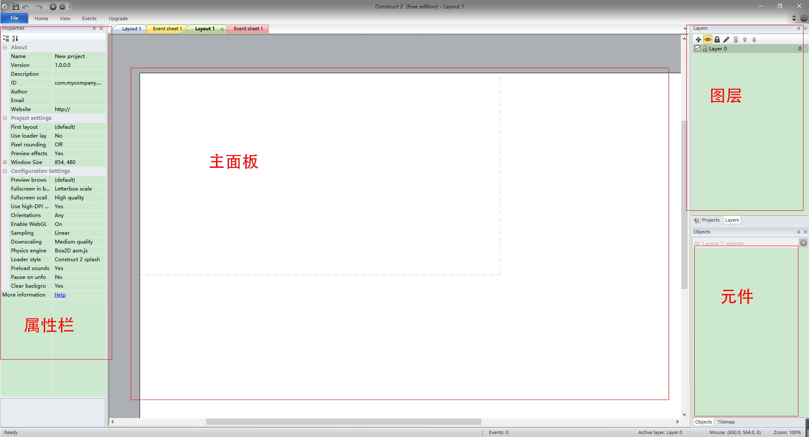

### 属性栏

属性栏是控制元件以及图层属性的地方，可以调整大小以及增加动作及完成一系列操作

### 主面板

主面板是整个游戏的动画界面，是提供给玩家显示的界面。

### 图层以及元件

图层是主面板的多个分层，上面的图层会显示在下面的图层的上方，遮盖掉下面的图层。

元件则是游戏过程中的主要元素，玩家所扮演的角色，各种怪物以及特效都是由元件所当担的。

## 3.建立背景以及创建元件

首先，我们要创建背景板块。

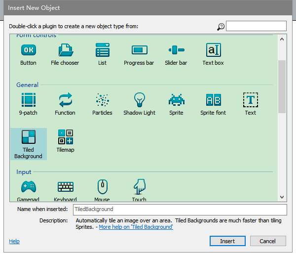

选择区域后，将背景图片选择进去

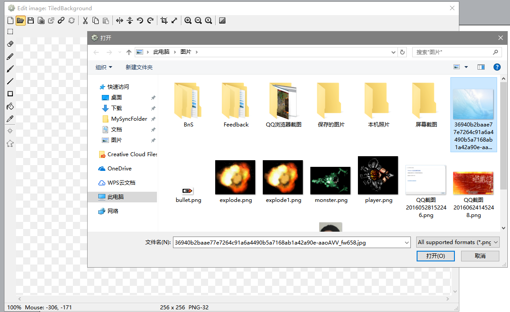

然后背景图片就显示出来啦

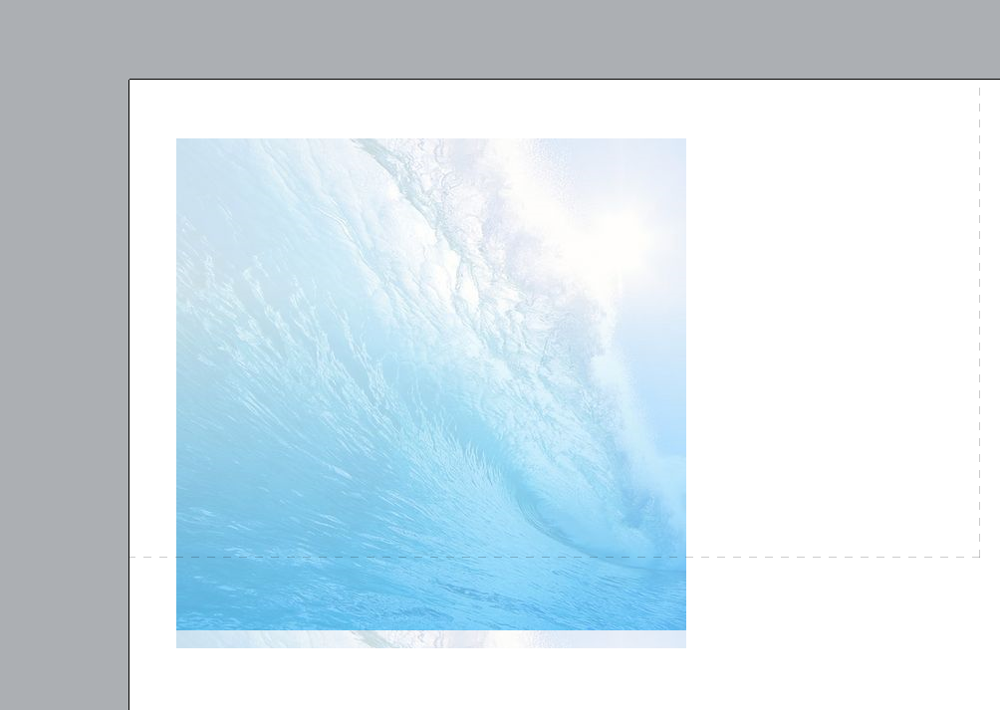

然后右键创建新项目

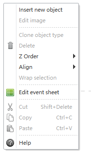

选择spirite

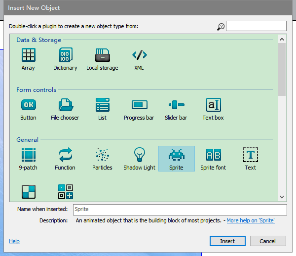

同理，选择图片后，元件也就创建出来了

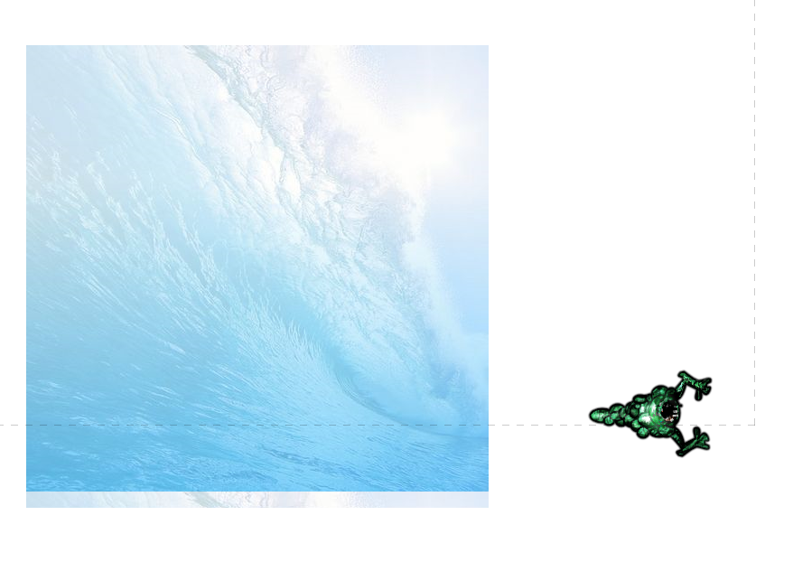

## 4.添加动作以及事件

那么问题来了，有了元件之后我们要怎么才能让元件动起来呢？

很简单，添加动作就可以了。

这时候就要用到属性栏了，单击元件，在属性栏中找到Behaviors

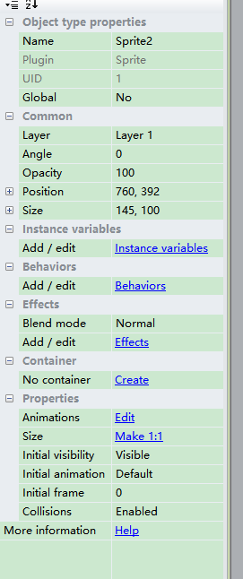

点击蓝色的Behaviors，进入动作界面，并选择加号添加动作

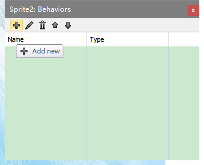

然后，选择Bullet（类似于子弹一样的平面移动）

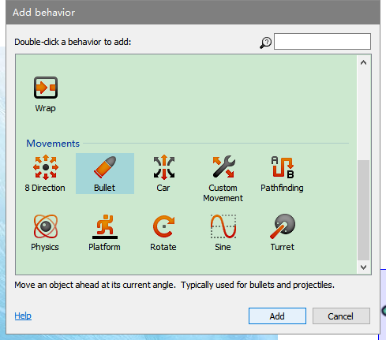

之后元件就会有动作了。

那么，游戏里那种子弹打到敌人，敌人消失的画面又是怎么做的呢？

这个时候，有请出我们这次的核心，事件。

事件就可以完成这项伟大的工程。

在主面板的上方，可以看到layout以及event sheet，单击event sheet，进入事件界面

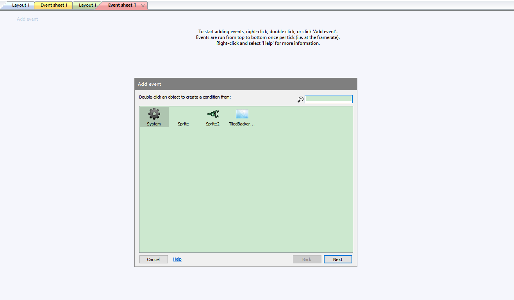

双击空白处，创建事件条件，选择子弹，然后选择 on the collision with another object
也就是和其他元件相遇时 

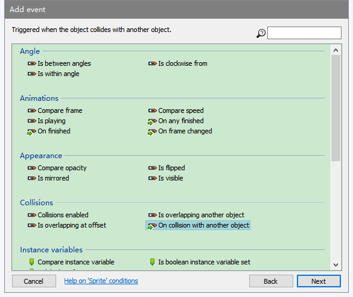

然后其他元件选择怪兽

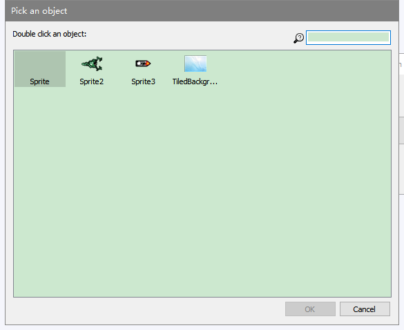

之后在点击 add action ，然后选择怪兽，选择destory

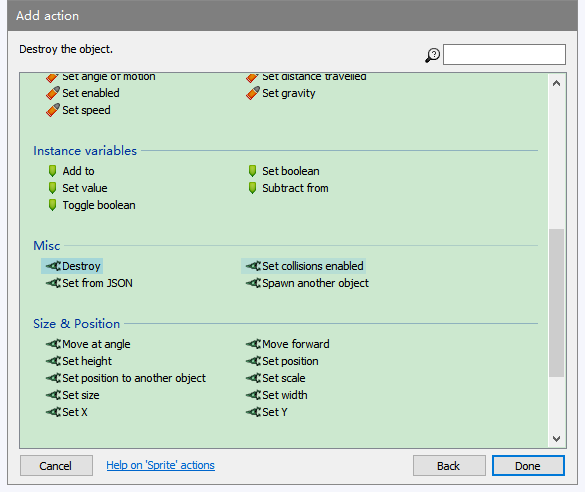

done后，事件就完成了，那么子弹遇到怪兽后，怪兽就会消失了！

## 5.添加文本以及最后的完善

在建立项目的框里有TEXT的选项，选择TEXT则会建立文本框。

然后建立不同的元件以及不同的事件后，就可以达到下面的效果

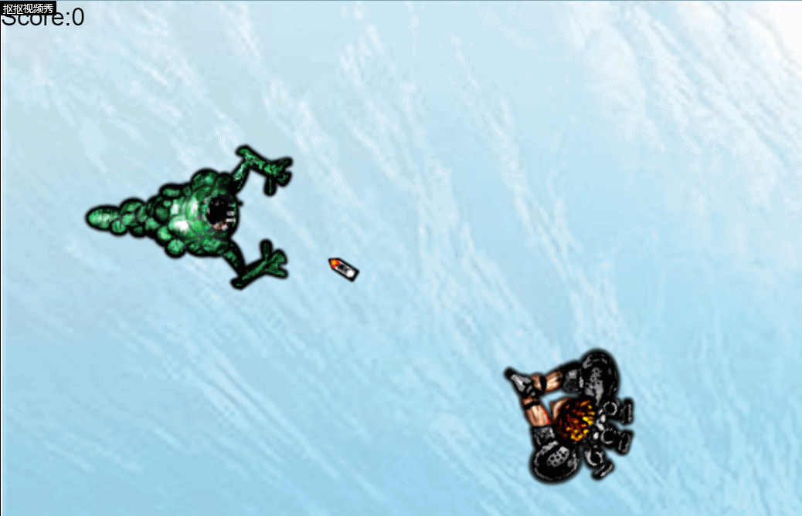