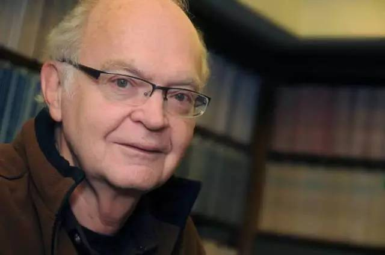
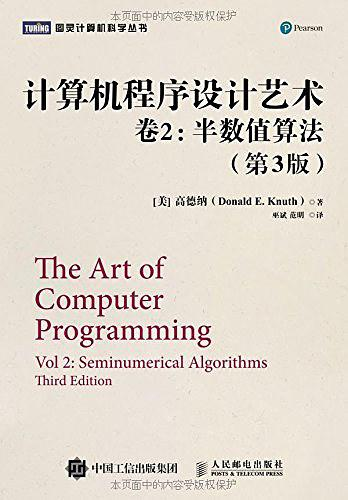

# IT人物介绍————高德纳

## 简介

         高德纳(Donald Ervin Knuth)——经典巨著《计算机程序设计的艺术》的年轻作者。洋洋数百万言的多卷本《计算机程序设计的艺术》(The Art of Computer Programming)堪称计算机科学理论与技术的经典巨著，有评论认为其作用与地位可与数学史上欧几里得的《几何原本》相比。本书作者高德纳(Donald Ervin Knuth)因而荣获1974年度的图灵奖。
         排版软件TeX和字型设计系统Metafont发明人，所著描述基本算法与数据结构的巨作《计算机程序设计的艺术》被《美国科学家》杂志列为20世纪最重要的12本物理科学类专著之一，与爱因斯坦《相对论》、狄拉克《量子力学》、理查·费曼《量子电动力学》等经典比肩而立。

## 生平

         高德纳1938年1月10日生于威斯康辛州密歇根湖畔的密尔沃基(Milwaukee)。这是一个山灵水秀、人才辈出的地方，“人工智能之父”、诺贝尔奖获得者西蒙(H．A．Simon)也是在这里出生的，获诺贝尔奖次年获图灵奖。但高德纳比西蒙小整整22岁，是一个“小字辈”。高德纳的父亲是一个多才多艺的人，有研究生学历，当过小学和中学教师，星期天在教堂演奏风琴，还在自家地下室办了一个小印刷厂。受父亲影响，高德纳从小喜欢学习和音乐，并表现出与众不同的才能。高德纳上8年级时，当地的Ziegler糖果厂为了促销其称为Giant Bar的一种棒棒糖，在学校中搞了一个比赛，看谁能用Ziegler’s Giant Bar中的字母排列组合出最多的单词。高德纳假装胃疼，在家里呆了两个星期，利用一部大字典，得出了4500个单词，比裁判掌握的2 000个单词多出一倍多，一举为他所在的班夺得冠军，赢得一台电视机和每人一块Giant Bar，而高德纳本人则赢得一付雪撬。
        
        1960年，高德纳在开思理工学院毕业，不但被授予学士学位，还被破例同时授予硕士学位。之后他进入加州理工学院研究生院，1963年获得博士学位，留校工作至1968年，然后转入斯坦福大学任教，其间1972—1973年曾经在奥斯陆大学当客座教授。

        20世纪70年代中期，高德纳和其他一些计算机科学家曾经设想在未来10年中将产生一种比现有程序设计语言更加强大，更加优美的新型语言，并预先命名它为“乌托邦84'’(Utopia 84)语言。1992年，高为潜心写作TAOCP从斯坦福提前退休，同时停用电子邮箱(他自1975年就开始玩电邮)。2008年，TAOCP前三卷出版30年后，第四卷在高粉的千呼万唤中终于面世，此际的高德纳已然是满头白发。对计算机科学的倾心热爱，使他为这部作品耗费了毕生心血：从及冠之年直至古稀老人。

## 所获荣誉

        高德纳获得的荣誉与奖励极多。ACM除了授予他图灵奖和软件系统奖外，还在1971年授予过他以COBOL的发明人、女计算机科学家霍泼(Grace Murray Hopper)命名的奖项，这个奖项是专门奖励30岁以下的优秀青年计算机科学家的。这样，高德纳一人就先后获得ACM的三个奖项，在1999年以前，这是计算机科学家中仅有的一位(1999年，布鲁克斯获得图灵奖，从而也拥有ACM三个奖项，平了高德纳的记录)。无独有偶，美国数学会也先后授予高德纳三个奖项，即Lester R．Ford奖(1975)、J．B．Priestley奖(1981)和Steele奖(1986)。1979年，当时的美国总统卡特向他颁发了全国科学奖章。IEEE授过他两个奖：McDowell奖(1980)和计算机先驱奖(1982)。1994年，瑞典科学院授予高德纳Adelskold奖。1995年他获得冯·诺伊曼奖和Harvey奖。1996年他获得日本INAMORI基金会设立的KYOTO奖，这个奖是专门奖励在高科技领域作出贡献的科学家的。面对这么多荣誉，高德纳都以平常心对待，据说，纪念他获得图灵奖的碗现在只是被他用来盛放水果

## 贡献之一

        《计算机程序设计的艺术》系列，开始于他念博士期间，计划出七卷，第一卷《基本算法》于1968年出版，第二卷《半数字化算法》于1969年出版，第三卷《排序与搜索》于1973年出版，第四卷《组合算法》于2008年出版。《计算机程序设计的艺术》一书以其内容的丰富和深刻喻为经典，有人甚至称之为“计算机的圣经”，被译为俄、日、西、葡、匈牙利、罗马尼亚等多种文字在世界各国广泛流传，其发行量创造了计算机类图书的最高记录，直至20世纪80年代中期，都一直保持着月销售量每卷达2000册的势头，成为Addison-Wesley出版社成立以来销路最好的图书。我国也由苏运霖翻译并出版了《计算机程序设计艺术》一书。