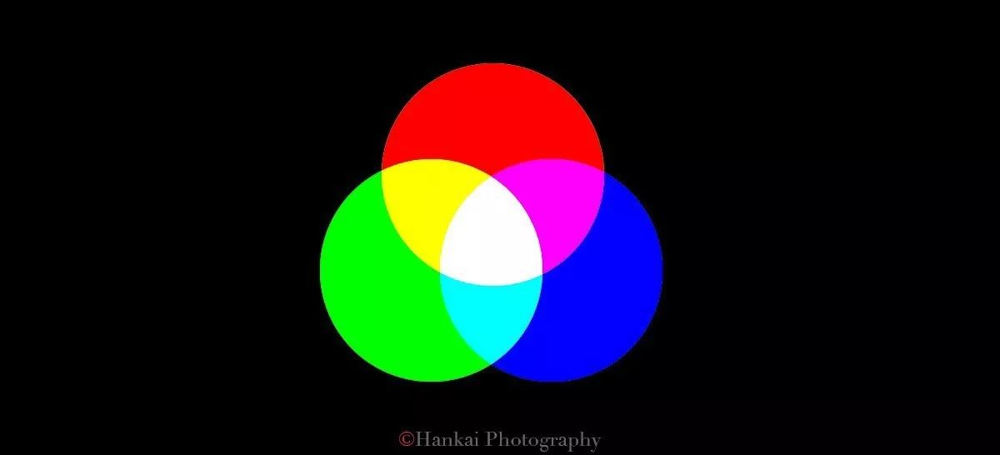
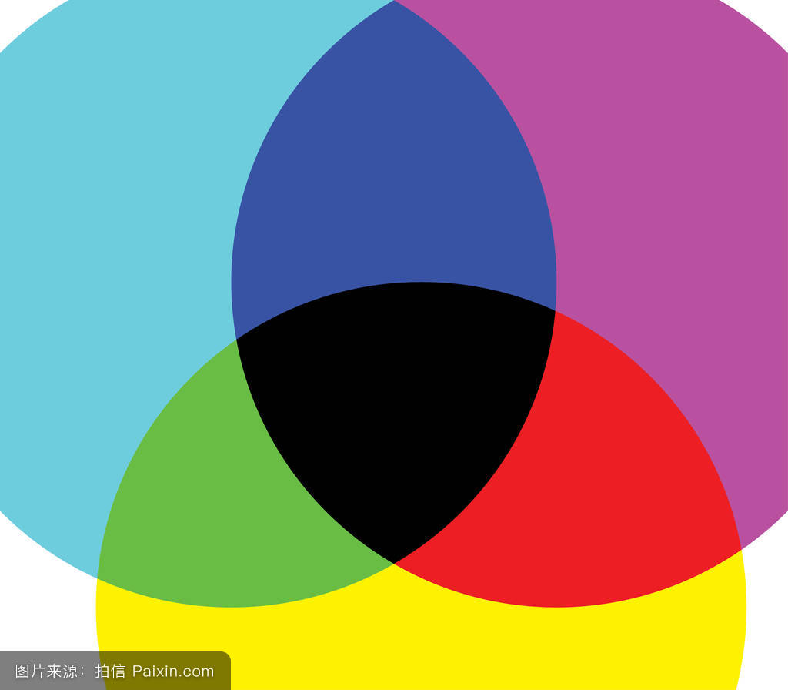

# 探索计算机的奥秘————色彩表示与编码

    一直对计算机能够表示不同的颜色感到很好奇，所以上课后又上网学习了一下，终于了解了色彩表示的奥秘。

## 色彩编码表

    原来计算机中竟然有这么多颜色需要储存，颜色竟然是用编码表示的。

## 色彩表示的方法

    计算机中色彩表示的方法有很多：RGB模式、CMYK模式、HSB模式等等，在此我们仅对RGB以及CMYK这两种模式进行讨论

### RGB

    RGB色彩模式是工业界的一种颜色标准，是通过对红(R)、绿(G)、蓝(B)三个颜色通道的变化以及它们相互之间的叠加来得到各式各样的颜色的，RGB即是代表红、绿、蓝三个通道的颜色，这个标准几乎包括了人类视力所能感知的所有颜色，是目前运用最广的颜色系统之一。

     目前的显示器大都是采用了RGB颜色标准，在显示器上，是通过电子枪打在屏幕的红、绿、蓝三色发光极上来产生色彩的，目前的电脑一般都能显示32位颜色，有一千万种以上的颜色。

     电脑屏幕上的所有颜色，都由这红色绿色蓝色三种色光按照不同的比例混合而成的。一组红色绿色蓝色就是一个最小的显示单位。屏幕上的任何一个颜色都可以由一组RGB值来记录和表达。

     因此这红色绿色蓝色又称为三原色光，用英文表示就是R(red)、G(green)、B(blue)。

  
     在电脑中，RGB的所谓“多少”就是指亮度，并使用整数来表示。通常情况下，RGB各有256级亮度，用数字表示为从0、1、2...直到255。注意虽然数字最高是255，但0也是数值之一，因此共256级。如同2000年到2010年共是11年一样。
     
     按照计算，256级的RGB色彩总共能组合出约1678万种色彩，即256×256×256=16777216。通常也被简称为1600万色或千万色。也称为24位色(2的24次方)。
     
     在led领域利用三合一点阵全彩技术， 即在一个发光单元里由RGB三色晶片组成全彩像素。随着这一技术的不断成熟，led显示技术会给人们带来更加丰富真实的色彩感受。

### CMYK

    印刷四色模式是彩色印刷时采用的一种套色模式，利用色料的三原色混色原理，加上黑色油墨，共计四种颜色混合叠加，形成所谓“全彩印刷”。四种标准颜色是：C：Cyan = 青色，又称为‘天蓝色’或是‘湛蓝’M：Magenta = 品红色，又称为‘洋红色’；Y：Yellow = 黄色；K：key=关键，这里的K指代key，是打印设备校准用的。另外，K:还可以代表Black，黑色，因为印刷用黑色用的比较多。

    CMYK也称作印刷色彩模式，顾名思义就是用来印刷的。它和RGB相比有一个很大的不同：RGB模式是一种发光的色彩模式，你在一间黑暗的房间内仍然可以看见屏幕上的内容；

    CMYK是一种依靠反光的色彩模式，我们是怎样阅读报纸的内容呢？是由阳光或灯光照射到报纸上，再反射到我们的眼中，才看到内容。它需要有外界光源，如果你在黑暗房间内是无法阅读报纸的。

    只要在屏幕上显示的图像，就是RGB模式表现的。只要是在印刷品上看到的图像，就是CMYK模式表现的。比如期刊、杂志、报纸、宣传画等，都是印刷出来的，那么就是CMYK模式的了。

## 总结

    通过网上的学习，我了解到颜色编码的奥秘，以及对于了解未知事物的方法