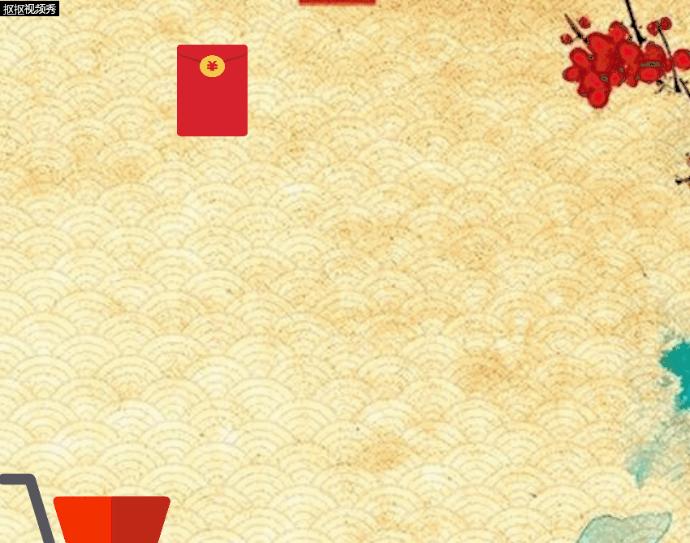

# 双十一抢红包游戏策划

## 楔子

    之前的双十一大家剁手了没呀，想必那时候大家都是在为了各个商业平台的优惠活动伤透了脑筋。这也是我制作这个游戏的思路来源。天空会随机生成1元的红包，不同份额的红包掉落速度会不一样，你要做的就是用你的购物车尽可能地收集到多的红包。
### 人设与道具（Game Sprites）：
    1.player 购物车 可以装载无限多的红包
    2.object 红包 随机会从天上掉下来，落到地面会消失

## CRC Card

| 购物车 ||                            |
| ------ | ------ | ------ |
| Attributes 购物车状 |
|Collaborator | Events & Actions|
|     None        |   碰到红包，红包消失，购物车计分增加红包金额                  |

| 购物车 ||                            |
| ------ | ------ | ------ |
| Attributes 红包状 |
|Collaborator | Events & Actions|
|     None        |   碰到购物车，红包消失；碰到地面，红包消失                  |

