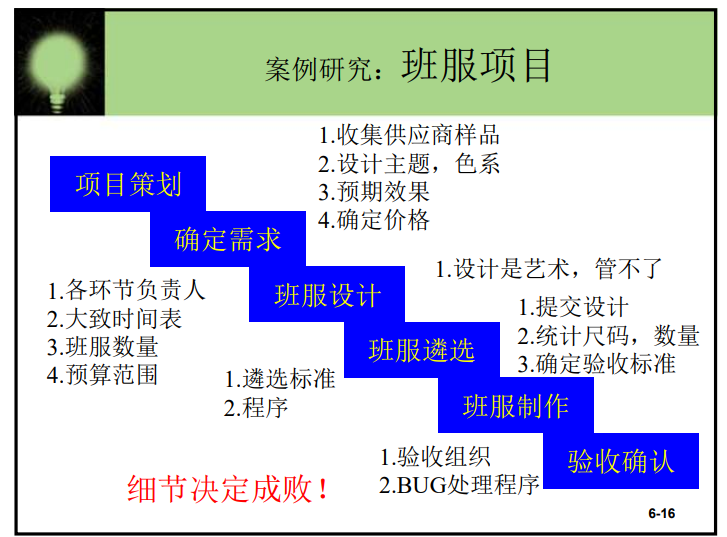

# 自上而下，逐步求精的编程方法以及洗衣机算法

## 自上而下，逐步求精的编程方法

    Top-down and bottom-up are both strategies of information processing and knowledge ordering, used in a variety of fields including software, humanistic and scientific theories (see systemics), and management and organization. In practice, they can be seen as a style of thinking, teaching, or leadership.

    A top-down approach (also known as stepwise design and in some cases used as a synonym of decomposition) is essentially the breaking down of a system to gain insight into its compositional sub-systems in a reverse engineering fashion. In a top-down approach an overview of the system is formulated, specifying, but not detailing, any first-level subsystems. Each subsystem is then refined in yet greater detail, sometimes in many additional subsystem levels, until the entire specification is reduced to base elements. A top-down model is often specified with the assistance of "black boxes", which makes it easier to manipulate. However, black boxes may fail to clarify elementary mechanisms or be detailed enough to realistically validate the model. Top down approach starts with the big picture. It breaks down from there into smaller segments.

    A bottom-up approach is the piecing together of systems to give rise to more complex systems, thus making the original systems sub-systems of the emergent system. Bottom-up processing is a type of information processing based on incoming data from the environment to form a perception. From a cognitive psychology perspective, information enters the eyes in one direction (sensory input, or the "bottom"), and is then turned into an image by the brain that can be interpreted and recognized as a perception (output that is "built up" from processing to final cognition). In a bottom-up approach the individual base elements of the system are first specified in great detail. These elements are then linked together to form larger subsystems, which then in turn are linked, sometimes in many levels, until a complete top-level system is formed. This strategy often resembles a "seed" model, by which the beginnings are small but eventually grow in complexity and completeness. However, "organic strategies" may result in a tangle of elements and subsystems, developed in isolation and subject to local optimization as opposed to meeting a global purpose.

    自上而下和自下而上这两种策略都是信息处理和知识排序，用于软件、人文主义和科学理论等多个领域(见系统学)，以及管理和组织。在实践中，它们可以被看作是一种思维、教学或领导风格。

    自上而下方法(也称为分步设计在某些情况下用作分解)本质上是对一个系统的分解，以便以逆向工程的方式洞察它的组成子系统。在自顶向下的方法中，系统的概述被制定，指定，但不详细，任何一级子系统。然后对每个子系统进行更详细的细化，有时在许多额外的子系统级别上进行细化，直到将整个规范简化为基本元素。自顶向下的模型通常是在“黑匣子”的帮助下指定的，这使得操纵变得更加容易。然而，黑匣子可能无法澄清基本的机制，或详细到实际验证模型。自上而下的方法从全局开始。它从那里分解成较小的部分。

    自下而上方法是将系统拼凑在一起，产生更复杂的系统，从而使原有的系统子系统成为应急系统的子系统。自下而上处理是信息处理基于来自环境的传入数据，从而形成知觉。从认知心理学的角度来看，信息从一个方向进入眼睛(感官输入，或“底层”)，然后被大脑转化为一幅图像，可以被解释和识别为一种感知(从加工到最终认知的“积累”输出)。在自下而上的方法中，首先详细地指定了系统的各个基本元素。然后将这些元素连接在一起形成更大的子系统，然后再将子系统连接起来，有时是在许多层次上，直到形成一个完整的顶层系统。这种策略通常类似于一个“种子”模型，在这个模型中，初始阶段很小，但最终在复杂性和完整性方面增长。然而，“有机战略”可能会导致元素和子系统的纠结，这些要素和子系统是孤立地发展起来的，并受制于局部优化，而不是满足全球目标。
## 洗衣机

### 1.伪代码

    选择 洗衣模式 输入 水位，相关洗衣项目
    注水至预设水位
    浸泡预设时间
    漂洗预设时间
    电机转动,左转3秒，右转3秒
    排水至水位为0
    脱水（左转80秒右转80秒）

### 2.基本伪代码

    READ(WATER,PROJECT);
    WHILE getwatervolume()<WATER>
        waterinswitch(open)
    ENDWHIL
        waterinswitch(close)
        SET S=timecounter()
        WHILE timecounter()<=S+rinse_time
        SET S1=timecounter()
        motorrun(left)
        IF timecounter()==S1+3
            motorrun(right)
        ENDIF
        IF timecounter()==S1+6
            motorrun(stop)
        ENDIF
    ENDWHILE
    FOR i=1 to 10
        S1=timecounter();
        motorrun(left)
        IF timecounter()==S1+100
            motorrun(right)
        ENDIF
        IF timecounter()==S1+200
            motorrun(stop)
        ENDIF
    ENDFOR
    wateroutswitch(close)
    halt(success)

### 3.快速洗衣

    快速洗衣比标准少了浸泡的过程,可以加快脱水时的频率.

### 4.模块化伪代码

    FUNCTION wait(time)
    SET S=timecounter();
    WHILE timecounter()<=S+soak_time
    ENDWHILE
    ENDFUNCTION

    FUNCTION 注水(volume,timeout)
    SET S=timecounter();
    WHILE getwatervolume()<volume
        waterinswitch(open);
        IF timecounter()S+timeout
        halt(failure)
        BREAK
        ENDIF
    ENDWHILE
    waterinswitch(close)
    ENDFUNCTION

    FUNCTION 排水(timeout)
    SET S=timecounter();
    WHILE getwatervolume()>0
     wateroutswitch(open)
     IF timecounter()S+timeout
       halt(failure)
       BREAK
     ENDIF
    ENDWHILE
    ENDFUNCTION