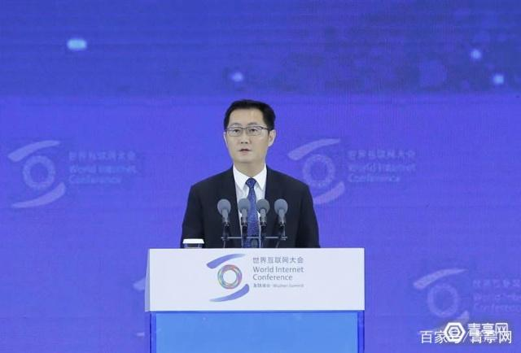

# 人工智能与医疗

## AI用于医学成像

    据悉，这家韩国科技巨头连同其医疗设备子公司三星Medison在芝加哥举行的北美放射学会2018年会（RSNA 2018）上展示了各种类型的诊断成像软件。其中产品包括：超声波、数字X摄线、计算机断层扫描和磁共振成像（MRI）。

    在RSNA 2018上，三星展示了最新发布的S-Detect for Breast使用了超声图像分析乳腺病变，并可提供标准报告和分类。根据意大利巴勒莫大学放射学教授Tommaso Bartolotta发表的一项研究表明，该软件将诊断准确率从0.83提高到0.87。

    此外，三星还发布了用于数字放射成像的AI软件，被称为SimGrid，提供胸部X射线中被骨骼遮挡的肺组织图像；用于计算机断层扫描的移动笔画单元，并正在开发人工智能技术，使MRI能够显示膝关节软骨厚度和膝关节炎图像等信息。

    源自中关村在线

## AI诊断

    腾讯的科技能力是毋庸置疑的，所以这次所发出的AI辅诊是腾讯自家AI研发出来的结果。这是继去年“腾讯觅影”发布AI辅助诊疗能力后，腾讯在近日就正式开放“腾讯觅影”的AI辅诊引擎，这是腾讯首次发布AI医学辅助诊疗开发平台，准备让医院、医疗信息化厂商可以通过开发的的借口使用腾讯觅影ＡＩ辅诊引擎，实现智能化医疗服务。

    此外腾讯觅影ＡＩ辅诊引擎还具有学习功能，也就是意味着可以通过模拟医生的成长学习，来不断的更进。可以帮助医生诊断和预测多大７００多疾病。医院门诊多达90％的高频诊断腾讯觅影都可以完全覆盖，这不得不说有助于医院的门诊效率，对医疗上有很大的帮助。 但是还是有很人不放心，毕竟是关系到人的生命健康，如果设备出现了一点错误，那么就会出现很严重的后果，所以如果腾想将AI技术提过给医院进行辅诊，那么在这方面还是要多多关注。

    源自笑谈说声

## 日本或花百亿建造AI医院

    据日经中文网13日报道，日本政府、产业界、大学以及研究机关联合打造“人工智能(AI)医院”，计划2022年度之前建立10家导入“AI医疗”系统的示范医院，预计投入超过100亿日元(约合6亿元人民币)。

    报道称，“AI医疗”是指利用人工智能技术，实现高质量医疗。“AI医院”利用AI技术可以自动录入病例、诊断影像，选择最佳治疗方案，有望解决高额医疗费以及慢性病医生不足的结构性问题。日本政府计划以日本文部科学省、经济产业省、厚生劳动省为中心，8月开始募集有参与意向的企业和医院，9月内初具规模。然而，目前日本药企的AI活用率相对较低。日本制药工业协会调查显示，在其加盟的71家企业中活用AI技术的案例有69件，其中外资企业占比84%，日本企业占比27%。

## AI治疗抑郁以及其伦理问题

    望闻问切，AI多种手段预测抑郁，让自杀无处可逃

    智能相对论易敏总结下来，目前AI主要是通过以下几种方式预测抑郁症。

    1、望，AI通过眼球运动判断性格。德国斯图加特大学、南澳大利亚大学等机构的研究人员使用最先进的机器学习算法，用来证明性格和眼球运动之间的关系。研究发现眼球运动能显示一个人性格是否外向还是内向。而算法软件能够识别出“大五人格”中的四种：神经质、外向型、宜人性、尽责性。抑郁症中有一种“微笑型抑郁”是最容易误诊且最危险的，这类患者一般表面微笑且阳光，普通咨询师很难通过面部情绪诊断，在社会中这类人也极容易被周围人忽略。当AI能够通过眼球运动判断性格的时候，AI诊断隐藏的“微笑型抑郁症”可能比心理咨询师更具优势，AI能更精准的判断眼球运动的情况。

    2、闻，AI根据语音特征预测抑郁。南加州大学的研究员们开发出了一套名叫SimSensei的人工智能工具。SimSensei可以从抑郁症患者中辨别特定的语音特征，因此辅助诊断。在面诊过程中会倾听病人的声音特征，记录检测该病人的声音。有心理障碍或神经疾病的人会降低他们的元音发音，心理医生可能会听不清楚。SimSensei根据他们元音发音的大小，推测患者是否患有抑郁，相对来说心理医生就会面临听不清楚发音的劣势。

    3、问，相对于传统心理咨询，AI直接可以跳过问这个环节。传统心理咨询一般会给出特定的问题测试，大部分人极容易被引导或者由于在心理诊疗室里不会按照内心真实的想法去作答。相对这类缺点，AI表现出极大的优势，麻省理工学院（MIT）的研究人员建立了人工智能模型，可以在不需要回答特定问题的情况下根据人们自然会话和写作风格来判断他们是否患有抑郁症。传统的提问方式有时候会因为医生本身的引导而影响了患者原本的情绪，而且传统提问方式会设定特定的问题，不利于患者个体化交流。该模型识别抑郁症的成功率达到了77％，远高于传统咨询师的诊断率。

    4、切，AI根据海量数据分析自杀倾向。今年1月底，一位来自阿根廷北部的女性在自己的Facebook上写了这样一段话：“不能再这样下去了，到了说再见的时候了。”仅仅不到三小时后，一组医护人员赶到了这位女性的家中，并且挽救了她的生命，而这一切都源于AI技术。Facebook的自杀预警系统，是研究人员使用AI技术对海量数据进行梳理，例如电子病历、社交媒体内容、患者的音频和视频录像等，来寻找自杀倾向的人共同点，然后预判可能有哪些新患者会自杀。

    AI应用在抑郁症患者的可期待场景还有很多，但是随之而来的也引发了一些关于伦理问题的讨论。例如：接受了大量的负面数据，AI是否会给出负面的诊疗方案。AI目前仅仅是基于大数据进行深度计算，但是当AI真正成为心理咨询师会接受大量的患者数据，目前AI还没有像人类一样拥有爱恨情仇，不过如果接受大量的负面数据，对于原本没有抑郁症的患者会不会给出负面的诊疗方案，要知道抑郁药物对于正常人副作用极大。AI是否会泄露病人隐私。当国家还没有出现类似的法律时，患者的隐私如何才能安全的得到保护，能否与用户签订隐私保护协议。不过相信在不久的将来AI在突破这些壁垒之后一定在治疗抑郁症上大有作为，更好的造福抑郁患者。

    源自电子发烧友网