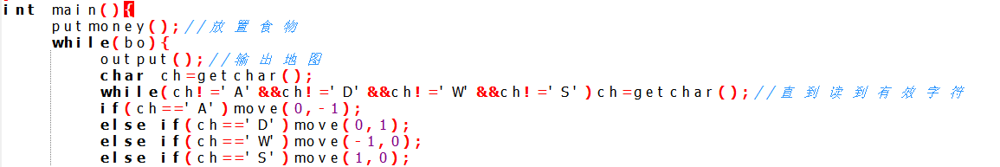

# 贪吃蛇的游戏设计及算法

## 游戏设计
    这是一个蛇吃食物长大变长的游戏，玩家需要操作贪吃蛇来吃到更多的食物使自己的蛇变得更长
    蛇每吃到一个食物则会变长一个单位长度
    蛇碰到边界或者自己的身体则会死亡，那么游戏就结束了
    对于一个贪吃蛇我们需要一个游戏地图

    H代表蛇的头部，X代表蛇的身体
    然后，蛇需要食物来长大嘛，所以我们需要放置食物

    地图、食物和蛇都有了
    那么，玩家是怎么操作蛇的呢？

## 代码实现

    // main.c
    // snake
    // Create by nanzhang
    #include<stdio.h>
    #include<stdlib.h>
    #include<time.h>
    #define maxline 20
    #define head 'H'
    #define body 'X'
    #define blank_block ' '
    #define food '$'
    #define wall '*'
    char map[11][11]=
    {"**********",
    "*XH      *",
    "*        *",
    "*        *",
    "*        *",
    "*        *",
    "*        *",
    "*        *",
    "*        *",
    "**********"
    };// 初始化地图 
    int length=2,bo=1;//蛇的长度以及游戏是否结束的标志 
    int x[21]={0,1,1};//表示蛇每个部位的x 
    int y[21]={0,2,1};//表示蛇每个部位的y 
    void putmoney(){
    	int xx1=rand()%9+1;
    	int yy1=rand()%9+1;
    	while(map[xx1][yy1]!=' '){
    	xx1=rand()%9+1;
    	yy1=rand()%9+1;	
    	}
    	map[xx1][yy1]='$';
    }
    void move(int addx,int addy){
    	if(map[x[1]+addx][y[1]+addy]!=' '&&map[x[1]+addx][y[1]+addy]!='$'){
    				bo=!bo;
    			}
    			else if(map[x[1]+addx][y[1]+addy]=='$'){
    					length++;
	    				for(int i=1;i<=length;++i)
		    			map[x[i]][y[i]]=' ';
			    		for(int i=length;i>1;--i){
				    		x[i]=x[i-1];
					    	y[i]=y[i-1];
						    map[x[i]][y[i]]='X';
					    }
    					x[1]=x[1]+addx;
    					y[1]=y[1]+addy;
	    				map[x[1]][y[1]]='H';
		    			putmoney();
			    }
    			else{
	    			for(int i=1;i<=length;++i)
		    			map[x[i]][y[i]]=' ';
			    	for(int i=length;i>1;--i){
				    		x[i]=x[i-1];
					    	y[i]=y[i-1];
						    map[x[i]][y[i]]='X';
    					}
	    				x[1]=x[1]+addx;
		    			y[1]=y[1]+addy;
			    		map[x[1]][y[1]]='H';
    			}
    }
    void output(){
    	system("CLS");
    	for(int i=0;i<10;++i)
    			printf("%s\n",map[i]);//输出地图 
    	}
    void GG(){
    	for(int i=1;i<10;++i) 
    	printf("Game Over!\n");//游戏结束 
    }
    int main(){
    	putmoney();//放置食物 
    	while(bo){
	    	output();//输出地图 
    		char ch=getchar();
	    	while(ch!='A'&&ch!='D'&&ch!='W'&&ch!='S')ch=getchar();//直到读到有效字符 
	    	if(ch=='A')move(0,-1);
	    	else if(ch=='D')move(0,1);
	    	else if(ch=='W')move(-1,0);
	    	else if(ch=='S')move(1,0);
    }
	    GG();//游戏结束 
    }