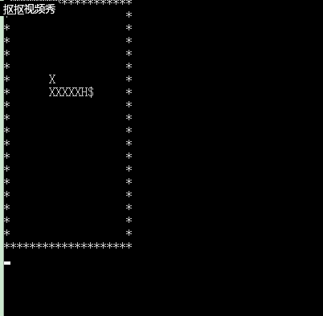

#智能蛇的实现

## 智能蛇的实验目的

    1.了解 算法 与 “智能” 的关系
    2.通过算法赋予蛇智能
    3.了解 Linux IO 设计的控制
## 智能蛇的伪代码

    // Hx,Hy: 头的位置
    // Fx,Fy：食物的位置
	function whereGoNext(Hx,Hy,Fx,Fy) {
	// 用数组movable[3]={“a”,”d”,”w”,”s”} 记录可走的方向
	// 用数组distance[3]={0,0,0,0} 记录离食物的距离
	// 分别计算蛇头周边四个位置到食物的距离。H头的位置，F食物位置
	//     例如：假设输入”a” 则distance[0] = |Fx – (Hx-1)| + |Fy – Hy|
	//           如果 Hx-1，Hy 位置不是Blank，则 distance[0] = 9999
	// 选择distance中存最小距离的下标p，注意最小距离不能是9999
	// 返回 movable[p]
	}
    输出字符矩阵
	WHILE not 游戏结束 DO
        wait(time)
		ch＝whereGoNext(Hx,Hy,Fx,Fy)
		CASE ch DO
		‘A’:左前进一步，break 
		‘D’:右前进一步，break    
		‘W’:上前进一步，break    
		‘S’:下前进一步，break    
		END CASE
		输出字符矩阵
	END WHILE
	输出 Game Over!!! 

## 智能蛇实现代码

    // main.c
    // snake
    // Create by nanzhang
    #include<stdio.h>
    #include<stdlib.h>
    #include <sys/stat.h>
    #include <sys/types.h>
    #include <sys/wait.h>
    #include<time.h>
    #include<math.h>
    #define maxline 20
    #define head 'H'
    #define body 'X'
    #define blank_block ' '
    #define food '$'
    #define wall '*'
    char map[21][21]=
    {"********************",
    "*XH                *",
    "*                  *",
    "*                  *",
    "*                  *",
    "*                  *",
    "*                  *",
    "*                  *",
    "*                  *",
    "*                  *",
    "*                  *",
    "*                  *",
    "*                  *",
    "*                  *",
    "*                  *",
    "*                  *",
    "*                  *",
    "*                  *",
    "*                  *",
    "********************"
    };// 初始化地图 
    int length=2,bo=1;//蛇的长度以及游戏是否结束的标志 
    int x[210]={0,1,1};//表示蛇每个部位的x 
    int y[210]={0,2,1};//表示蛇每个部位的y 
    int m1[4]={0,0,-1,1};//蛇移动的x坐标改变量 
    int m2[4]={-1,1,0,0};//蛇移动的y坐标改变量 
    int fx,fy;//食物的位置
    int WhereGoNext(int hx,int hy,int fx,int fy){
	int	distance[4]={9999,9999,9999,9999};
	int id=-1,minn=10001;
	    for(int i=0;i<4;++i){
    		if(map[hx+m1[i]][hy+m2[i]]==' '||map[hx+m1[i]][hy+m2[i]]=='$'){
    			distance[i]=fabs(fx-hx-m1[i])+fabs(fy-hy-m2[i]);
    			if(distance[i]<=minn)minn=distance[i],id=i;
    		}
    	}
    	return id;
    }   
    void putmoney(){
	    int xx1=rand()%19+1;
	    int yy1=rand()%19+1;
	    while(map[xx1][yy1]!=' '){
	    xx1=rand()%19+1;
	    yy1=rand()%19+1;	
	    }
	    fx=xx1;
	    fy=yy1; 
	    map[xx1][yy1]='$';
    }
    void move(int id){
	    if(id==-1){bo=!bo;return ;}
			else if(map[x[1]+m1[id]][y[1]+m2[id]]=='$'){
					length++;
					for(int i=1;i<=length;++i)
					map[x[i]][y[i]]=' ';
					for(int i=length;i>1;--i){
						x[i]=x[i-1];
						y[i]=y[i-1];
						map[x[i]][y[i]]='X';
					}
					x[1]=x[1]+m1[id];
					y[1]=y[1]+m2[id];
					map[x[1]][y[1]]='H';
					putmoney();
			}
			else{
				for(int i=1;i<=length;++i)
					map[x[i]][y[i]]=' ';
				for(int i=length;i>1;--i){
						x[i]=x[i-1];
						y[i]=y[i-1];
						map[x[i]][y[i]]='X';
					}
					x[1]=x[1]+m1[id];
					y[1]=y[1]+m2[id];
					map[x[1]][y[1]]='H';
			}
    }
    void output(){
	    system("CLS");
	    for(int i=0;i<20;++i)
			printf("%s\n",map[i]);//输出地图 
	}
    void GG(){
	    for(int i=1;i<10;++i) 
	    printf("Game Over!\n");//游戏结束 
    }
    int main(){
	    putmoney();//放置食物 
	    while(bo){
            wait(1);
		    output();//输出地图 
		    move(WhereGoNext(x[1],y[1],fx,fy));
        }
	    GG();//游戏结束 
    }

## 智能蛇动态图

## 小BUG

    实际上，在运行一段时间后，智能蛇会因为走最近的路线导致自己走不了下一步而Game Over，所以每一次走最优路线是不能确保最后能到食物的，算法以后还要改进。

## 感想

    在这次智能蛇的制作过程中，我深刻的体会到伪代码的重要性。有时候没有思路但可以先写伪代码，写完伪代码之后，整个思路就很清晰，真正的代码也就很容易地写出来了。

