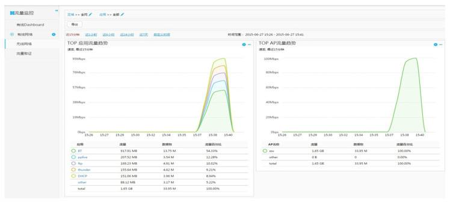
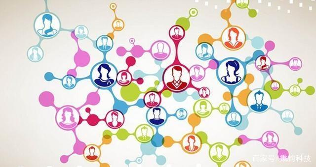

# 互联网时代的盈利模式

## 流量的基本概念

        
        通常说网站流量是指网站的访问量，是用来描述访问一个网站的用户数量以及用户所浏览的页面数量等指标，常用的统计指标包括网站的独立用户数量（一般指IP）、总用户数量（含重复访问者）、页面浏览数量、每个用户的页面浏览数量、用户在网站的平均停留时间等
        一般来说，流量大的网站，被用户所访问到的几率以及在其网站上投放广告被关注点击的几率较大，相对的同样大小的广告位的价格也相对较贵。
## 流量的基本指标

    1.独立访问者数量（unique visitors）；
    2.重复访问者数量（repeat visitors）；
    3.页面浏览数（page views）；
    4.每个访问者的页面浏览数（Page Views per user）；
    5.某些具体文件/页面的统计指标，如页面显示次数、文件下载次数等。

## 流量为什么火起来

        
        因为只有让人们关注到你的公司或者你的产品，你才有变现获利的操作空间。互联网上每天生产的信息太多，每个人花在互联网上的时间是有限的，投入在互联网中的注意力也是有限的。而流量代表的就是人们的注意力，要想人们在如此庞大的信息量中将注意力集中到你需要的地方，就必须花费一定的代价，吸引这些代表人们注意力的流量。
        流量就是市场，流量就是消费者，流量就是财富，流量也是金钱。烧钱做流量是因为有了代表市场、消费者、财富和金钱的流量后，付出的金钱自然能赚回来，还能带来更大的利润。

## 目前常见的两个盈利模式

### 1. 商家到用户

        这个盈利只需要考虑两个方面：商家和用户或者说是B2C模式。1、这种模式是直接销售，用户从商家手里面购买商品是当下比较流行的模式，如：自营商城、软件站卖软件等。2、还有一些提供增值服务，这就很多了比如：游戏点卡充值、QQ会员、卖喇叭、卖虚拟鲜花、充值话费等。

### 2. 用户到商家再到用户

        这种模式涉及到了第三方就需要给予平台一些费用。通常是进驻该平台的费用，有的平台还会收取一定的佣金费用，因为互联网的冲击和个人欲望的高涨导致人们之间的信任度大大降低，第三方平台给予了必要的保障如：淘宝、天猫、京东等，当然平台不仅仅限于商品也可以用于服务。

## 互联网如何利用流量盈利

### 1. 流量引导

        顾名思义是对外界进行流量的一个输出，比如：hao123首页、网址导航站、百度、360等搜索引擎，这种流量引导也是通过收取一定的费用来变现的。

### 2. 内部消化

        本身就能够提供互联网的相关产品或者是服务能够让用户甘心付款，比如：付费游戏、付费会员、付费道具等。

### 3. 卖广告

        通常在流量的入口处，目的是展示，比如：banner广告、文字和视频广告等，由于广告性质比较强所以这也是人们反感的地方。

### 4. 广告联盟

        很多做内容或工具类的网站、app或社群的流量变现方式，就是通过自己拥有的渠道去推广告联盟的产品，从中赚取推广佣金的模式。

## 新的方式：构建流量池

        那么，假如流量都被大公司大企业近乎强盗般掠夺去，那么中小公司如何崛起？
        这就要讲到下面这个方式了：构建流量池
        如果说“生态”，大家一定很熟悉，流量池与之相似，却也有不同之处。构建流量词的目的其实就是为了避免营销成本的浪费，让收集来的流量放在一个地方，用心维护，使之能够循环利用，甚至多次被使用，减少因为第一次营销获得的用户在第二次进行营销时还要重复花钱的问题。
        其次，我们要考虑的就是如何留住用户，这时候我们面临两大问题：品牌与内容。品牌是企业的标签，让用户能记住你，这里我们可以建立社区（也就是流量池），然后你的内容不能一成不变，一定要定期更新升级，给用户新的体验。其次就是社区建立好了，就是社区运营了，这个我们以前讲过，具体参考《运营半年社群从20人到5000+，变现50万+太牛了》，维护好用户，就达到了流量复用的目的了。

