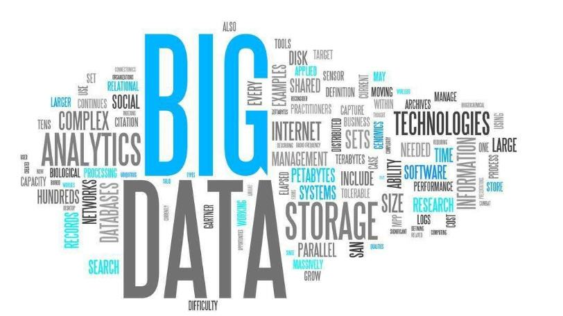

# 互联网时代的热点领域以及营销方法

## I 热点领域

### 1.ipv6

    ipv4已经基本上被开发完全，现在很多国家开始普及ipv6。
### 2.python

    得益于大数据、人工智能技术的飞速发展以及相关支持，python等语言得以快速被人所熟知，所利用。
### 3.大数据

    数据就是基础。
### 4.自媒体

    媒体的形式逐渐从传统的报纸、杂志转向相对自由也更加小的比如微信公众号以及抖音的个人媒体。
### 5.人工智能

    在机械化工作逐渐被机器所取代，人们开始寻求是否存在着类似于人的智能。
### 6.区块链

    区块链是分布式数据存储、点对点传输、共识机制、加密算法等计算机技术的新型应用模式。
### 7.物联网

    物联网就是物物相连的互联网。

## II 营销方法

### 1.超前消费

    在这个人们对于自己未来收入相当自信的时代，互联网采用花呗、白条等方式，让用户进行提前消费。
   

### 2.广告促销

    在各个平台采用广告弹窗或者广告插入的方式，宣传自己的产品，从而获得更多的消费群众。

### 3.直播短视频

    在用户流量极大的抖音等短视频APP上制作相关宣传视频，或者是在一个大流量主播的直播内容中加入相关宣传。

### 4.电子商务

    在物联网的基础上，电子商务平台如淘宝、京东等发展迅速。传统的营销限制包括时间、空间的限制。比如说电子商务就是一个比较大的网络营销市场，市场上没有时间限制，能够全天候的进行服务，这就改变了传统实体店营业的时间模式。并且传统的实体营销还有地点的限制，实体店的服务范围也有限，这就不能够满足一些距离比较远的顾客的需求，使得顾客出门购买不便利、成本比较高，但是电子商务没有地域的限制，能够随时随地的购买商品